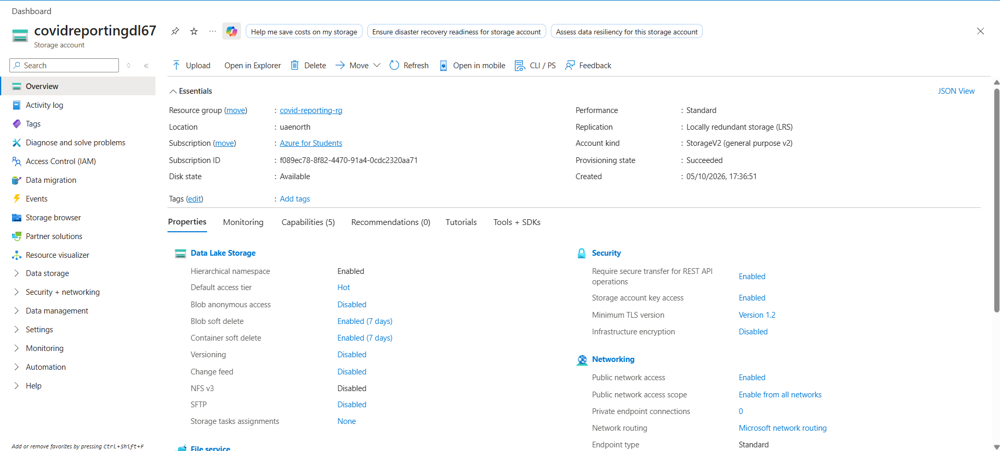

# Azure Data Lake Storage Gen2

## Purpose

Azure Data Lake Storage Gen2 was created to serve as the main data lake
for the project.

It will store data used by the data engineering pipelines and provide
a structured storage layer for ingestion, transformation, and analytics.

## Resource Configuration

| Setting | Value |
|---|---|
| Resource Type | Azure Data Lake Storage Gen2 |
| Storage Account Name | `covidreportingdl67` |
| Resource Group | `covid-reporting-rg` |
| Region | `UAE North` |
| Performance | Standard |
| Replication | LRS |
| Hierarchical Namespace | Enabled |

## Screenshot

Azure Data Lake Storage Gen2 resource overview:

