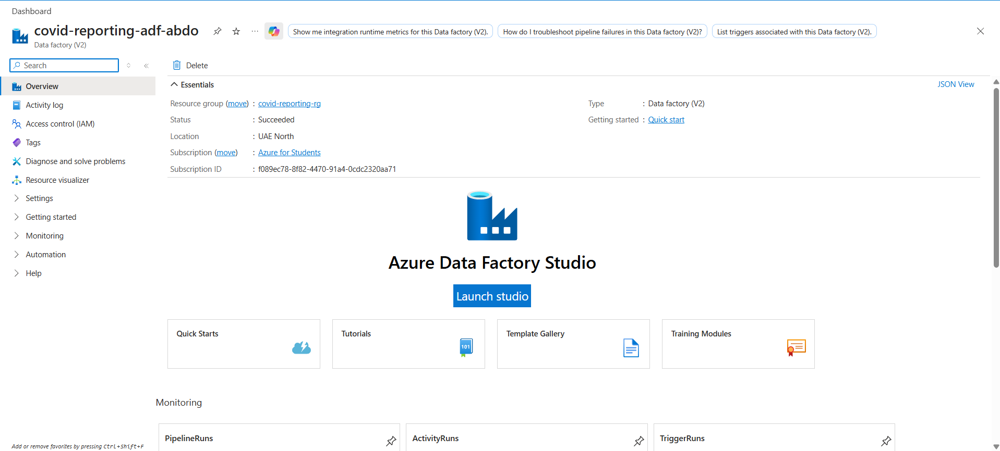

# Azure Data Factory Setup

## Overview

Azure Data Factory (ADF) is the orchestration service used in this project
to build, schedule, and monitor data ingestion and transformation workflows.

This document describes the initial Azure Data Factory resource provisioning.

---

## Resource Configuration

| Setting | Value |
|---|---|
| Resource Type | Azure Data Factory |
| Version | V2 |
| Resource Group | `covid-reporting-rg` |
| Data Factory Name | `covid-reporting-adf-abdo` |
| Region | `UAE North` |
| Deployment Status | Succeeded |

> Subscription identifiers, credentials, keys, and other sensitive values
> are intentionally excluded from this repository.

---

## Provisioning Steps

The Azure Data Factory resource was created through the Azure Portal.

The high-level provisioning process was:

1. Open Azure Portal.
2. Select **Create a resource**.
3. Search for **Data Factory**.
4. Select Azure Data Factory.
5. Select the project resource group.
6. Configure the Data Factory name and region.
7. Use **Data Factory V2**.
8. Defer Git integration until the CI/CD and source-control stage.
9. Keep the initial networking configuration at its default settings.
10. Review the configuration and deploy the resource.

---

## Why Data Factory V2?

Azure Data Factory V2 provides the capabilities required by this project,
including:

- Pipeline orchestration
- Data movement
- Control-flow activities
- Triggers
- Mapping Data Flows
- Monitoring
- Integration with external compute services
- Source-control integration

---

## Azure Data Factory Studio

After deployment, development is performed using Azure Data Factory Studio.

ADF Studio provides several major areas:

### Author

Used to create and manage:

- Pipelines
- Datasets
- Data Flows
- Activities

### Monitor

Used to monitor:

- Pipeline runs
- Activity runs
- Trigger runs
- Pipeline failures

### Manage

Used to manage:

- Linked Services
- Integration Runtimes
- Git configuration
- Triggers
- Factory configuration

---

## Git Integration

Git integration was intentionally not configured during the initial
provisioning stage.

Source-control integration will be configured later when the project
introduces Git and CI/CD practices.

This keeps the initial environment setup simple while allowing Git
integration to be introduced in a controlled way later.

---

## Resource Organization

The Azure Data Factory resource is deployed under:

`covid-reporting-rg`

The resource group will be used to organize Azure resources associated
with the project.

This makes it easier to:

- Manage project resources
- Monitor costs
- Apply access control
- Locate related resources
- Clean up resources after experimentation

---

## Screenshot

Azure Data Factory resource overview:

---

## Key Takeaways

- Azure Data Factory will act as the primary orchestration service.
- Data Factory V2 is used for the project.
- Project resources are grouped inside a dedicated Azure Resource Group.
- ADF Studio provides Author, Monitor, and Manage capabilities.
- Git integration will be configured later in the project.
- Sensitive Azure account information must never be committed to Git.