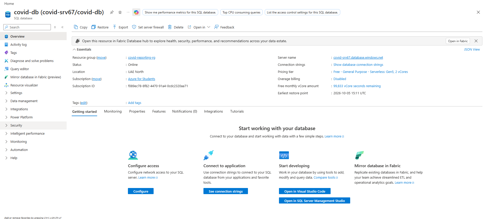

# Azure SQL Database

## Purpose

Azure SQL Database was created to provide the relational serving layer
for the project.

## Resource Configuration

| Setting | Value |
|---|---|
| Resource Type | Azure SQL Database |
| Database Name | `conid-db` |
| SQL Server | `<your-sql-server-name>` |
| Resource Group | `covid-reporting-rg` |
| Region | `UAE North` |
| Environment | Development |

## Screenshot

Azure Sql database overview:

