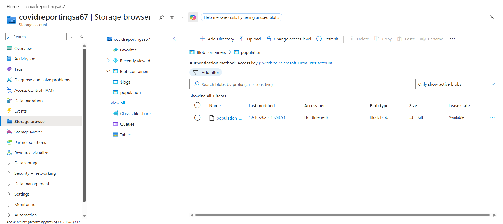
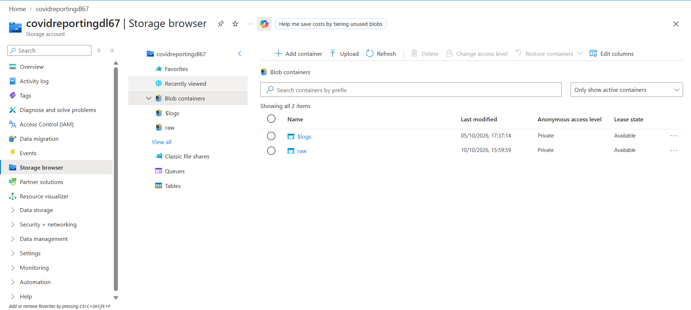

# Population Data Ingestion — Environment Preparation

## Overview

Prepared the source and destination storage environments for ingesting Eurostat population data using Azure Data Factory.

The dataset contains population statistics by age group for European countries.

This stage covers storage preparation only. The Azure Data Factory ingestion pipeline will be implemented in subsequent lessons.

## Source — Azure Blob Storage

The population dataset was uploaded to an Azure Blob Storage container.

### Source Configuration

| Property | Value |
|---|---|
| Storage Account | `covidreportingsa67` |
| Storage Type | Azure Blob Storage |
| Container | `population` |
| Access Level | Private |
| File | `population_by_age.tsv.gz` |
| File Format | GZip-compressed TSV |

### Implementation

1. Opened the existing Azure Storage Account.
2. Created a Blob container named `population`.
3. Configured the container with private access.
4. Uploaded the compressed population dataset supplied with the course materials.

**Source path:** `population/population_by_age.tsv.gz`

## Destination — Azure Data Lake Storage Gen2

Created the destination container in the existing ADLS Gen2 storage account.

### Destination Configuration

| Property | Value |
|---|---|
| Storage Account | `covidreportingdl67` |
| Storage Type | Azure Data Lake Storage Gen2 |
| Container | `raw` |
| Target Directory | `population/` |
| Expected Output File | `population_by_age.tsv` |

### Implementation

1. Opened the existing ADLS Gen2 Storage Account.
2. Navigated to Blob Containers.
3. Created a container named `raw`.

The destination container is ready for ingestion. The `population` directory and output TSV file have not been created yet.

## Expected Data Movement

The upcoming Azure Data Factory pipeline will copy the compressed source file into ADLS Gen2 and decompress it into TSV format.

**Source:** `covidreportingsa67/population/population_by_age.tsv.gz`

**Destination:** `covidreportingdl67/raw/population/population_by_age.tsv`

The destination path and decompression are planned requirements, not completed operations.

## Implementation Status

| Task | Status |
|---|---|
| Create source storage account | Completed |
| Create destination ADLS Gen2 account | Completed |
| Create source `population` container | Completed |
| Upload compressed population file | Completed |
| Create destination `raw` container | Completed |
| Configure ADF Linked Services | Pending |
| Configure source and sink Datasets | Pending |
| Create and execute Copy Activity | Pending |
| Verify copied and decompressed file | Pending |

## Screenshots

**Source container and uploaded file**

**Destination raw container**

