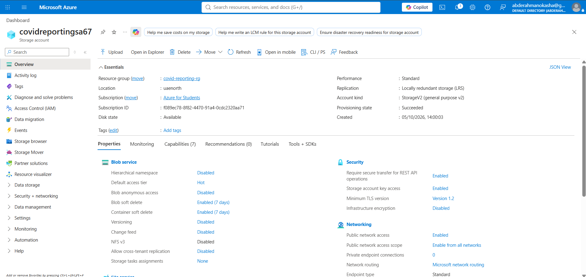

# Azure Storage Account

## Purpose

An Azure Storage Account was created to provide Blob Storage for the project.

It will be used to store source files that Azure Data Factory will later read
during the data ingestion stage.

## Resource Configuration

| Setting | Value |
|---|---|
| Resource Type | Azure Storage Account |
| Storage Account Name | `covidreportingsa67` |
| Resource Group | `covid-reporting-rg` |
| Region | `UAE North` |
| Performance | Standard |
| Replication | LRS |
| Hierarchical Namespace | Disabled |

## Role in the Architecture

At this stage, the storage account acts as the source file storage layer.

```text
Source Files
     ↓
Azure Blob Storage
     ↓
Azure Data Factory
     ↓
Data Processing / Data Lake
```


## Screenshot

Azure Storage Account resource overview:


